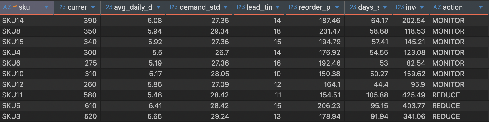

# inventory-optimization-sql-project

## Business Problem
Companies face two main issues:
- Running out of products (stockouts)
- Holding too much inventory (cash tied up)

This project identifies which SKUs are at risk and what actions to take.

---

## What I built 
A SQL model that:
- Calculate demand and variability
- Uses supplier lead time
- Computes safety stock and reorder point
- Classifies SKUs into:
  - REORDER
  - MONITOR
  - REDUCE
 
---

## Key Results 
- No SKUs currently need imedicate reorder
- SKU 8, 6, 12 show highest stockout risk
- Some SKUs have excess inventory (high days of supply)

## Sample Output
This table shows how SKUs are classified into actions:

---

## Business Actions 
- REORDER -> when inventory <= reorder point
- MONITOR -> close  to reorder point
- REDUCE -> too much inventory

---

## Tools Used
- PostgreSQL
- SQL

---
